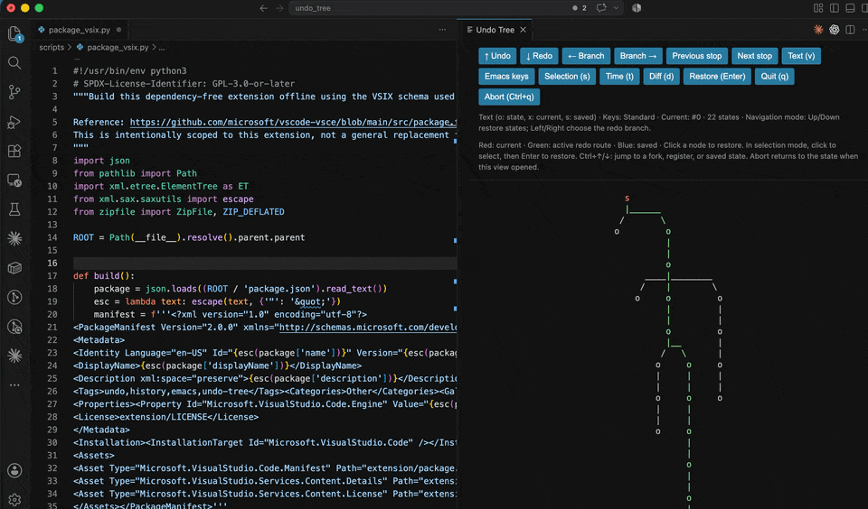

# Undo Tree for VS Code

**Port of Toby Cubitt's Emacs undo-tree.**

This extension brings the branching history and visualizer of [undo-tree 0.8.2](https://www.dr-qubit.org/undo-tree.html) to VS Code. The original design and algorithms are Toby Cubitt's; this project adapts them to VS Code and preserves the [upstream sources and credits](upstream/README.md).

[日本語](README.ja.md) · [Usage & settings](docs/USAGE.md) · [Porting notes](docs/PORTING.md)



## Features

- Keep alternate redo branches and restore any retained state.
- Explore history in SVG or Emacs-style text, with optional Emacs navigation keys.
- Preview diffs, select states without editing, and save history between sessions.

No Emacs installation is required.

## Install

Requires **VS Code 1.85+**. Build a VSIX with **Node.js 18+** and **Python 3.9+**:

```sh
npm run package
```

In VS Code, run **Extensions: Install from VSIX...** and select `branching-undo-tree-0.4.0.vsix`. A VSIX attached to a GitHub Release can also be used.

## Use

Run **Undo Tree: Visualize History**, or press `Ctrl+Alt+Z` (`Cmd+Option+Z` on macOS).

| Keys | Action |
| --- | --- |
| `↑` / `↓` | Undo / Redo |
| `←` / `→` | Choose a redo branch |
| `v` | Switch SVG / text views |
| `s`, then Enter | Select a state, then restore it |
| `d` | Toggle diff preview |
| `q` | Close the tree |

Enable **Emacs keys** for `C-p/n/b/f` navigation. `C` means Control, including on macOS; `M` means Alt/Option. To use text and Emacs keys by default:

```json
{
  "undoTree.visualizerStyle": "text",
  "undoTree.visualizerKeybindings": "emacs"
}
```

Standard editor Undo/Redo shortcuts use Undo Tree by default; set `undoTree.overrideStandardUndo` to `false` to keep existing bindings. Saved histories contain past document content. Region-only undo and Emacs history-file compatibility are not implemented. See [usage and limitations](docs/USAGE.md) for details.

## Development

Open the project in VS Code and press **F5**. No dependency installation or build step is needed.

```sh
npm test
npm run check
```

Tests compare behavior with the original Emacs package, using saved reference results and live Emacs runs when available. See [Contributing](CONTRIBUTING.md), [Changelog](CHANGELOG.md), and [Releasing](docs/RELEASING.md).

## License

**GPLv3 or later** (`GPL-3.0-or-later`), following the original undo-tree. Upstream copyright and attribution notices are preserved. See [LICENSE](LICENSE) and [NOTICE](NOTICE).
